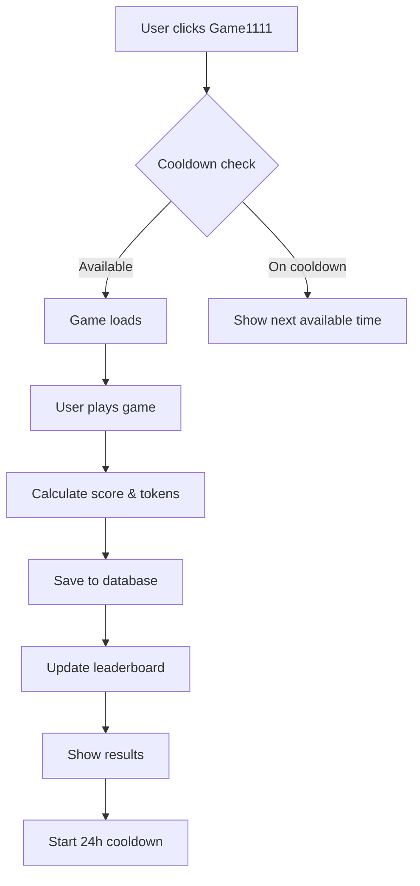

# Game1111 — Feature Spec (Recurring every 24 hours)

**Version**: 1.0  
**Owner**: Game Systems  
**Last Updated**: 2025-11-13  
**Status**: ✅ Core Implemented (needs scheduler + realtime)

---

## Purpose

Game1111 is a recurring gameplay quest that runs on a 24-hour cadence. Users match a target frequency (1111 Hz) using their voice, earning tokens based on proximity to the target.

**Lore**: *"In the Zo Protocol, harmony isn't just heard—it's felt. Channel your voice to sync with the quantum frequency of 1111 Hz and earn your place among the resonators."*

---

## Cadence

**Current** (v1.0): 24-hour cooldown per user
- User can play once every 24 hours
- No global windows, individual cooldowns

**Future** (v2.0): 12-hour global windows
- Window opens every 12 hours (e.g., 00:00 & 12:00 UTC)
- Submission period: 30 minutes
- Verification period: 15 minutes
- All users compete in same window

---

## Gameplay Mechanics

### Objective
Get as close to 1111 Hz as possible using your voice

### Controls
- User speaks/hums into microphone
- Real-time frequency analysis (Web Audio API)
- Visual feedback with neon rings
- 10-second time limit

### Scoring Formula
```typescript
function calculateScore(userFrequency: number): number {
  return Math.abs(1111 - userFrequency);
}
```

**Score range**: 0 (perfect) to 2222 (worst)

**Examples**:
| User Hz | Distance | Score | Performance |
|---------|----------|-------|-------------|
| 1111 | 0 | 0 | Perfect! |
| 1105 | 6 | 6 | Excellent |
| 1095 | 16 | 16 | Great |
| 1070 | 41 | 41 | Good |
| 1050 | 61 | 61 | Fair |
| 1000 | 111 | 111 | Try again |

### Win Condition
```typescript
const hasWon = Math.abs(1111 - userFrequency) <= 50;
```

**Win threshold**: Distance ≤ 50 Hz (score between 1061-1161)

**Why 50 Hz?**
- Achievable with practice
- Not too easy (prevents token farming)
- Balances skill vs. luck

---

## Token Rewards (Dynamic Calculation)

### Core Formula
```typescript
function calculateTokensEarned(score: number): number {
  const distance = Math.abs(1111 - score);
  
  // Perfect score: 100 tokens
  if (distance === 0) return 100;
  
  // Within 10 Hz: 80-99 tokens
  if (distance <= 10) {
    return Math.floor(100 - distance);
  }
  
  // Within 50 Hz: 50-80 tokens
  if (distance <= 50) {
    return Math.floor(80 - (distance - 10) * 0.75);
  }
  
  // Within 100 Hz: 20-50 tokens
  if (distance <= 100) {
    return Math.floor(50 - (distance - 50) * 0.6);
  }
  
  // Beyond 100 Hz: 5-20 tokens (consolation)
  return Math.max(5, Math.floor(20 - (distance - 100) * 0.1));
}
```

### Reward Examples
| User Score | Distance | Tokens | Performance |
|------------|----------|--------|-------------|
| 1111 | 0 | 100 | Perfect! |
| 1105 | 6 | 94 | Excellent |
| 1095 | 16 | 84 | Great |
| 1070 | 41 | 57 | Good |
| 1050 | 61 | 33 | Fair |
| 1000 | 111 | 18 | Try again |
| 500 | 611 | 5 | Consolation |

---

## Flow (v1.0 - Current)

### User Flow


### Backend Flow
1. User submits score via `POST /api/quests/complete`
2. Server checks cooldown (24 hours)
3. If available:
   - Calculate tokens using `calculateTokensEarned(score)`
   - Insert into `completed_quests`
   - Update `users.zo_points`
   - Trigger leaderboard update
4. Return rewards + next available time

---

## API

### Submit Game1111 Score
```typescript
POST /api/quests/complete

Request:
{
  user_id: string;
  quest_id: "game-1111-quest";
  score: number;                // User's frequency (e.g., 1095)
  location: "webapp" | "mobile";
  metadata: {
    quest_title: "Quantum Voice Sync";
    completed_via: "webapp";
    game_won: boolean;
    reward_zo: number;          // Pre-calculated tokens
  };
}

Response (Success):
{
  success: true;
  completion_id: string;
  rewards: {
    zo_tokens: number;
    reputation: {
      explorer: 5
    };
  };
  next_available_at: string;    // ISO timestamp (24 hours from now)
}

Response (Cooldown):
{
  success: false;
  error: "Quest is on cooldown";
  next_available_at: string;
  details: {
    cooldown_hours: 24;
    time_remaining_minutes: number;
  };
}
```

---

## DB Surface

### `quests` table (Game1111 Entry)
```sql
INSERT INTO quests (slug, title, quest_type, cooldown_hours, rewards_breakdown)
VALUES (
  'game-1111-quest',
  'Quantum Voice Sync',
  'mini_game',
  24, -- 24-hour cooldown
  '{
    "zo_tokens": null,
    "reputation": { "explorer": 5 },
    "items": []
  }'::jsonb
);
```

### `completed_quests` table (Completion Record)
```sql
INSERT INTO completed_quests (
  user_id, 
  quest_id, 
  score, 
  reward_amount, 
  location, 
  metadata
) VALUES (
  'did:privy:xxx',
  'uuid-of-game1111-quest',
  1095,  -- User's score
  84,    -- Tokens earned
  'webapp',
  '{
    "quest_title": "Quantum Voice Sync",
    "completed_via": "webapp",
    "game_won": true,
    "reward_zo": 84
  }'::jsonb
);
```

### Automatic Leaderboard Update
On insert to `completed_quests`, trigger updates `leaderboards` table:
```sql
-- See DATABASE_SCHEMA.md for full trigger definition
```

---

## Scheduling (v2.0 - Future)

### Window Management

**`game1111_windows` table**:
```sql
CREATE TABLE game1111_windows (
  id UUID PRIMARY KEY DEFAULT uuid_generate_v4(),
  starts_at TIMESTAMP NOT NULL,
  ends_at TIMESTAMP NOT NULL,
  status TEXT NOT NULL, -- 'pending', 'open', 'closed', 'verified'
  created_at TIMESTAMP DEFAULT NOW()
);

CREATE INDEX idx_windows_status ON game1111_windows(status, starts_at);
```

**`game1111_scores` table**:
```sql
CREATE TABLE game1111_scores (
  id UUID PRIMARY KEY DEFAULT uuid_generate_v4(),
  user_id TEXT REFERENCES users(id),
  window_id UUID REFERENCES game1111_windows(id),
  score INTEGER NOT NULL,
  tokens_earned INTEGER NOT NULL,
  proof_hash TEXT,
  verified BOOLEAN DEFAULT false,
  submitted_at TIMESTAMP DEFAULT NOW(),
  
  UNIQUE(user_id, window_id)
);

CREATE INDEX idx_scores_window ON game1111_scores(window_id, score);
```

### Scheduler (Cron/Job Queue)
```typescript
// Run every 12 hours
async function openGame1111Window() {
  const now = new Date();
  const windowStart = now;
  const windowEnd = new Date(now.getTime() + 30 * 60 * 1000); // 30 min later
  
  await db.query(`
    INSERT INTO game1111_windows (starts_at, ends_at, status)
    VALUES ($1, $2, 'open')
  `, [windowStart, windowEnd]);
  
  // Broadcast to all clients
  await supabase.channel('game1111')
    .send({
      type: 'broadcast',
      event: 'window_opened',
      payload: { windowId, starts_at: windowStart, ends_at: windowEnd }
    });
}

// Run every minute
async function closeExpiredWindows() {
  const now = new Date();
  
  await db.query(`
    UPDATE game1111_windows
    SET status = 'closed'
    WHERE status = 'open' AND ends_at < $1
  `, [now]);
  
  // Process results and update leaderboard
  await processWindowResults();
}
```

---

## Realtime (v2.0 - Future)

### Supabase Realtime Integration

**Broadcast Events**:
- `game1111.window.opened` - New window starts
- `game1111.window.closed` - Window ends
- `game1111.results.published` - Leaderboard updated

**Client Subscription**:
```typescript
const channel = supabase.channel('game1111');

channel
  .on('broadcast', { event: 'window_opened' }, (payload) => {
    // Show notification: "New Game1111 window is open!"
    // Update UI to show countdown
  })
  .on('broadcast', { event: 'window_closed' }, (payload) => {
    // Show results
    // Update leaderboard
  })
  .subscribe();
```

---

## Verification

### Basic Checks (v1.0)
- Timestamp is recent (within 5 minutes of submission)
- Score is within valid range (0-2222)
- User exists in database
- Cooldown has passed

### Advanced Checks (v2.0)
- **Replay protection**: Check `proof_hash` for duplicates
- **GPS bounding box**: Verify user location (optional)
- **Frequency validation**: Store raw frequency data and validate
- **Manual review**: Flag suspicious submissions for moderator review

---

## Telemetry

Track these events:
- `game1111_start` - User starts game
- `game1111_complete` - User completes game (include score)
- `game1111_submit` - Score submitted to API
- `game1111_cooldown` - User tries to play while on cooldown

**Event schema**: `{ ts, userId, questId, score?, tokensEarned?, onCooldown? }`

---

## Acceptance Criteria

- [x] Game1111 gameplay works (frequency detection, scoring)
- [x] Token calculation uses proximity formula
- [x] Cooldown system enforces 24-hour wait
- [x] Scores persist to `completed_quests`
- [x] Leaderboard updates automatically
- [ ] Scheduler opens/closes windows every 12 hours (v2.0)
- [ ] Realtime broadcasts work (v2.0)
- [ ] Load tests handle burst submissions (v2.0)

---

## Tests

### Unit Tests
```typescript
describe('Game1111 Token Calculation', () => {
  it('gives 100 tokens for perfect score', () => {
    expect(calculateTokensEarned(0)).toBe(100);
  });
  
  it('gives 94 tokens for distance of 6', () => {
    expect(calculateTokensEarned(6)).toBe(94);
  });
  
  it('gives 84 tokens for distance of 16', () => {
    expect(calculateTokensEarned(16)).toBe(84);
  });
  
  it('gives minimum 5 tokens for terrible scores', () => {
    expect(calculateTokensEarned(1000)).toBe(5);
  });
});
```

### Integration Tests
```typescript
describe('Game1111 Submission Flow', () => {
  it('submits score and receives rewards', async () => {
    const result = await POST('/api/quests/complete', {
      user_id: testUserId,
      quest_id: 'game-1111-quest',
      score: 1095
    });
    
    expect(result.success).toBe(true);
    expect(result.rewards.zo_tokens).toBe(84);
  });
  
  it('enforces 24-hour cooldown', async () => {
    // Submit once
    await completeGame1111(testUserId, 1095);
    
    // Try again immediately
    const result = await completeGame1111(testUserId, 1105);
    expect(result.success).toBe(false);
    expect(result.error).toContain('cooldown');
  });
  
  it('updates leaderboard after submission', async () => {
    const before = await getLeaderboard();
    await completeGame1111(testUserId, 1095);
    const after = await getLeaderboard();
    
    const userBefore = before.find(e => e.user_id === testUserId);
    const userAfter = after.find(e => e.user_id === testUserId);
    
    expect(userAfter.zo_points).toBeGreaterThan(userBefore.zo_points);
  });
});
```

### Scheduler Tests (v2.0)
```typescript
describe('Game1111 Scheduler', () => {
  it('opens window reliably every 12 hours', async () => {
    // Run scheduler for 72 hours (6 windows)
    const windows = await runSchedulerFor(72, 'hours');
    expect(windows.length).toBe(6);
    
    // Verify timing
    for (let i = 1; i < windows.length; i++) {
      const timeDiff = windows[i].starts_at - windows[i-1].starts_at;
      expect(timeDiff).toBeCloseTo(12 * 60 * 60 * 1000, 1000); // Within 1 second
    }
  });
  
  it('closes windows after 30 minutes', async () => {
    const window = await openWindow();
    await sleep(30 * 60 * 1000 + 100); // 30 min + 100ms
    await runCloseExpiredWindows();
    
    const updated = await getWindow(window.id);
    expect(updated.status).toBe('closed');
  });
});
```

### Load Tests (v2.0)
```typescript
describe('Game1111 Load Tests', () => {
  it('handles 1000 concurrent submissions', async () => {
    const window = await openWindow();
    
    // Simulate 1000 users submitting at once
    const submissions = Array.from({ length: 1000 }, (_, i) => 
      submitScore(`user-${i}`, window.id, Math.random() * 2222)
    );
    
    const results = await Promise.all(submissions);
    const successful = results.filter(r => r.success).length;
    
    expect(successful).toBe(1000);
    expect(results.every(r => r.processing_time < 500)).toBe(true); // < 500ms each
  });
});
```

---

## Current Implementation

**Location**: `apps/web/src/components/QuestAudio.tsx`

**Status**:
- ✅ Gameplay mechanics working
- ✅ Frequency detection accurate
- ✅ Score calculation implemented
- ⚠️ Token calculation needs integration (currently fixed reward)
- ❌ Data persistence not wired up
- ❌ Cooldown enforcement not connected
- ❌ Scheduler not implemented
- ❌ Realtime not implemented

**See**: `Docs/QUESTS_SYSTEM.md` for complete token calculation documentation

---

## Work Order Snippet

```markdown
# WO-XXX: Complete Game1111 Data Integration

## Scope
- Wire `QuestAudio.tsx` to call `/api/quests/complete`
- Implement `calculateTokensEarned()` function
- Add cooldown check UI (show next available time)
- Test full submission flow
- Add telemetry tracking

## Files to Modify
- `apps/web/src/components/QuestAudio.tsx`
- `apps/web/src/lib/questCalculations.ts` (new)
- `apps/web/src/hooks/useQuestCooldown.ts` (new)

## Acceptance Criteria
- Scores save to database on completion
- Tokens calculated dynamically based on proximity
- Cooldown shows countdown timer
- Leaderboard updates within 5 seconds

## Tests
- Integration test for submit flow
- Token calculation unit tests
- Cooldown enforcement test
```

---

## Related Documentation

- `Docs/QUESTS_SYSTEM.md` - Complete quest system documentation
- `Docs/API_CONTRACTS.md` - API endpoint contracts
- `Docs/DATABASE_SCHEMA.md` - Database schema
- `Docs/GAME1111_TECHNICAL_DOCUMENTATION.md` - Original Game1111 docs

