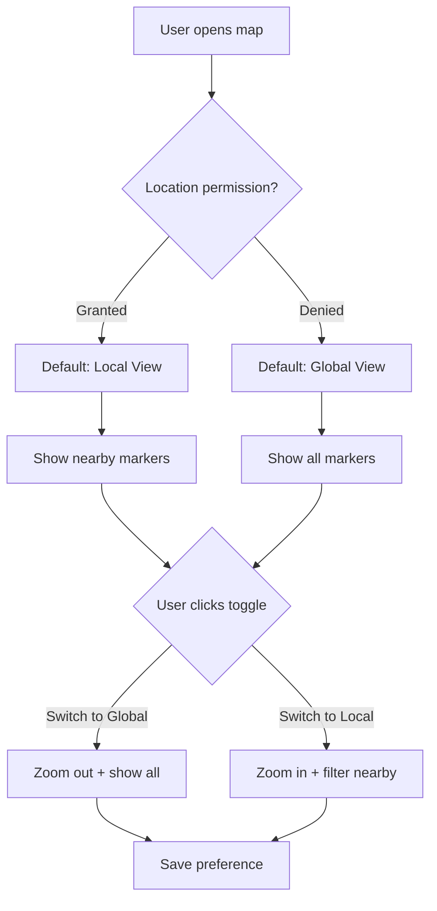

# Local/Global View — Feature Spec

**Version**: 1.0  
**Owner**: Frontend / UX  
**Last Updated**: 2025-11-13  
**Status**: ✅ Implemented

---

## Purpose

The Local/Global view toggle allows users to switch between two map perspectives:
- **Local View**: Shows nearby nodes, events, and quests based on user's current location
- **Global View**: Shows all nodes, events, and quests across all cities worldwide

This feature provides context-aware discovery while maintaining awareness of the global network.

---

## Key Capabilities

- Toggle between Local and Global map views
- Automatically detect user's location (with permission)
- Filter markers based on view mode
- Display counts of local vs global items
- Smooth transitions between views
- Persist view preference
- Loading states during location detection

---

## User Experience

### Visual Design

**Toggle Component**:
- **Local Mode**: Purple-pink gradient (MapPin icon)
- **Global Mode**: Blue-cyan gradient (Globe icon)
- Pill-shaped toggle with badges showing item counts
- Smooth color transitions on switch
- Loading spinner during location detection

**Map Behavior**:
- **Local Mode**: 
  - Zoom in to user's city (zoom level 12-14)
  - Show only markers within ~50km radius
  - Center on user's location
  - Highlight home city
  
- **Global Mode**:
  - Zoom out to world view (zoom level 2-4)
  - Show all markers worldwide
  - Center on world map
  - Show all active cities

### UX Flow



---

## API Contracts

### Get Local Markers

```typescript
GET /api/markers/local?lat={latitude}&lng={longitude}&radius={km}

Query Parameters:
- lat (number, required): User's latitude
- lng (number, required): User's longitude
- radius (number, optional): Radius in km (default: 50)

Response:
{
  success: true,
  data: {
    nodes: Node[],
    events: Event[],
    quests: Quest[],
    count: number
  }
}
```

### Get Global Markers

```typescript
GET /api/markers/global

Response:
{
  success: true,
  data: {
    nodes: Node[],
    events: Event[],
    quests: Quest[],
    cities: City[],
    count: number
  }
}
```

### Save View Preference

```typescript
POST /api/user/preferences

Request:
{
  user_id: string,
  map_view_mode: 'local' | 'global'
}

Response:
{
  success: true,
  data: {
    preferences_updated: true
  }
}
```

---

## Component Structure

### MapViewToggle Component

**Location**: `apps/web/src/components/MapViewToggle.tsx`

**Props**:
```typescript
interface MapViewToggleProps {
  viewMode: 'local' | 'global';
  onToggle: (mode: 'local' | 'global') => void;
  localCount?: number;      // Number of local items
  globalCount?: number;     // Number of global items
  className?: string;
  isLoading?: boolean;      // Show spinner during location fetch
}
```

**Usage**:
```tsx
<MapViewToggle
  viewMode={mapViewMode}
  onToggle={handleMapViewToggle}
  localCount={42}
  globalCount={1523}
  isLoading={isFetchingLocation}
/>
```

---

## Implementation Details

### Location Detection

```typescript
// Detect user's location
async function getUserLocation(): Promise<{ lat: number; lng: number }> {
  return new Promise((resolve, reject) => {
    if (!navigator.geolocation) {
      reject(new Error('Geolocation not supported'));
      return;
    }
    
    navigator.geolocation.getCurrentPosition(
      (position) => {
        resolve({
          lat: position.coords.latitude,
          lng: position.coords.longitude
        });
      },
      (error) => {
        reject(error);
      },
      {
        enableHighAccuracy: true,
        timeout: 5000,
        maximumAge: 300000 // Cache for 5 minutes
      }
    );
  });
}
```

### Distance Calculation (Haversine)

```typescript
// Calculate distance between two points (in km)
function calculateDistance(
  lat1: number,
  lon1: number,
  lat2: number,
  lon2: number
): number {
  const R = 6371; // Earth's radius in km
  const dLat = (lat2 - lat1) * Math.PI / 180;
  const dLon = (lon2 - lon1) * Math.PI / 180;
  
  const a = 
    Math.sin(dLat/2) * Math.sin(dLat/2) +
    Math.cos(lat1 * Math.PI / 180) * Math.cos(lat2 * Math.PI / 180) *
    Math.sin(dLon/2) * Math.sin(dLon/2);
  
  const c = 2 * Math.atan2(Math.sqrt(a), Math.sqrt(1-a));
  return R * c;
}

// Filter markers within radius
function filterLocalMarkers(
  markers: Marker[],
  userLat: number,
  userLng: number,
  radiusKm: number = 50
): Marker[] {
  return markers.filter(marker => {
    const distance = calculateDistance(
      userLat,
      userLng,
      marker.latitude,
      marker.longitude
    );
    return distance <= radiusKm;
  });
}
```

### Map View Transitions

```typescript
// Handle view mode toggle
async function handleMapViewToggle(mode: 'local' | 'global') {
  setMapViewMode(mode);
  
  if (mode === 'local') {
    // Switch to local view
    setIsLoadingLocation(true);
    
    try {
      const location = await getUserLocation();
      setUserLocation(location);
      
      // Fetch local markers
      const localMarkers = await fetchLocalMarkers(
        location.lat,
        location.lng,
        50 // 50km radius
      );
      
      setMarkers(localMarkers);
      
      // Animate map to user location
      map.flyTo({
        center: [location.lng, location.lat],
        zoom: 13,
        duration: 1500
      });
    } catch (error) {
      console.error('Failed to get location:', error);
      // Fallback to home city
      if (userHomeCity) {
        map.flyTo({
          center: [userHomeCity.lng, userHomeCity.lat],
          zoom: 12,
          duration: 1500
        });
      }
    } finally {
      setIsLoadingLocation(false);
    }
  } else {
    // Switch to global view
    const globalMarkers = await fetchGlobalMarkers();
    setMarkers(globalMarkers);
    
    // Animate map to world view
    map.flyTo({
      center: [0, 20], // Centered on world
      zoom: 2,
      duration: 2000
    });
  }
  
  // Save preference
  await saveViewPreference(userId, mode);
}
```

---

## Database Schema

### User Preferences

```sql
-- Add map_view_mode to user preferences
ALTER TABLE users
ADD COLUMN map_view_mode TEXT DEFAULT 'local';

-- Add index for faster lookups
CREATE INDEX idx_users_view_mode ON users(map_view_mode);
```

### Spatial Queries

```sql
-- Query for nearby nodes (PostGIS)
SELECT * FROM nodes
WHERE ST_DWithin(
  ST_MakePoint(longitude, latitude)::geography,
  ST_MakePoint($1, $2)::geography,
  50000 -- 50km in meters
);

-- Alternative without PostGIS (less efficient)
SELECT *,
  (
    6371 * acos(
      cos(radians($1)) * 
      cos(radians(latitude)) * 
      cos(radians(longitude) - radians($2)) + 
      sin(radians($1)) * 
      sin(radians(latitude))
    )
  ) AS distance
FROM nodes
HAVING distance < 50
ORDER BY distance;
```

---

## UX Considerations

### Permission Handling

**Location Permission Denied**:
- Default to Global view
- Show message: "Enable location for Local view"
- Provide settings link
- Allow manual city selection

**Location Permission Granted**:
- Default to Local view
- Cache location for 5 minutes
- Update location on page reload
- Show accuracy indicator

### Loading States

```tsx
// Show spinner during location fetch
{isLoadingLocation && (
  <div className="absolute top-4 left-1/2 transform -translate-x-1/2 
    bg-white/90 backdrop-blur-md px-4 py-2 rounded-full shadow-lg">
    <div className="flex items-center gap-2">
      <Spinner size={16} />
      <span className="text-sm">Getting your location...</span>
    </div>
  </div>
)}
```

### Empty States

**Local View - No Nearby Items**:
```tsx
<div className="text-center p-8">
  <MapPin size={48} className="mx-auto text-gray-400 mb-4" />
  <h3 className="text-lg font-semibold mb-2">No nearby nodes</h3>
  <p className="text-gray-600 mb-4">
    There are no nodes within 50km of your location
  </p>
  <button onClick={() => onToggle('global')}>
    View Global Map
  </button>
</div>
```

**Global View - Loading**:
```tsx
<div className="text-center p-8">
  <Globe size={48} className="mx-auto text-blue-500 mb-4 animate-spin" />
  <p className="text-gray-600">Loading global network...</p>
</div>
```

---

## Telemetry

Track these events:
- `map_view_toggle` - User toggles view mode
- `map_view_local_load` - Local view loaded
- `map_view_global_load` - Global view loaded
- `location_permission_granted` - User grants location access
- `location_permission_denied` - User denies location access
- `location_fetch_failed` - Failed to get user location

**Event Schema**:
```typescript
{
  ts: string;
  userId: string;
  viewMode: 'local' | 'global';
  previousMode?: 'local' | 'global';
  localCount?: number;
  globalCount?: number;
  userLocation?: { lat: number; lng: number };
  error?: string;
}
```

---

## Performance Optimization

### Marker Clustering

```typescript
// In Local mode: Show all markers (fewer items)
// In Global mode: Cluster markers to reduce render load

if (viewMode === 'global' && markers.length > 100) {
  // Enable clustering
  map.addLayer({
    id: 'clusters',
    type: 'circle',
    source: 'markers',
    filter: ['has', 'point_count'],
    paint: {
      'circle-color': [
        'step',
        ['get', 'point_count'],
        '#51bbd6', 100,
        '#f1f075', 500,
        '#f28cb1'
      ],
      'circle-radius': [
        'step',
        ['get', 'point_count'],
        20, 100,
        30, 500,
        40
      ]
    }
  });
}
```

### Caching

```typescript
// Cache markers by view mode
const markerCache = new Map<'local' | 'global', Marker[]>();
const CACHE_DURATION = 5 * 60 * 1000; // 5 minutes

async function getMarkers(mode: 'local' | 'global'): Promise<Marker[]> {
  const cached = markerCache.get(mode);
  if (cached && Date.now() - cached.timestamp < CACHE_DURATION) {
    return cached.data;
  }
  
  const fresh = mode === 'local' 
    ? await fetchLocalMarkers()
    : await fetchGlobalMarkers();
  
  markerCache.set(mode, {
    data: fresh,
    timestamp: Date.now()
  });
  
  return fresh;
}
```

---

## Acceptance Criteria

- [x] Toggle component renders correctly
- [x] Local mode requests location permission
- [x] Global mode shows all markers
- [x] Map animates smoothly between views
- [x] Counts display accurately
- [x] View preference persists
- [ ] Loading states show during transitions
- [ ] Error handling for denied permissions
- [ ] Empty states display when no markers
- [ ] Performance optimized for 1000+ markers

---

## Tests

### Unit Tests

```typescript
describe('MapViewToggle', () => {
  it('renders with local and global buttons', () => {
    render(
      <MapViewToggle
        viewMode="local"
        onToggle={jest.fn()}
        localCount={42}
        globalCount={1523}
      />
    );
    
    expect(screen.getByText('Local')).toBeInTheDocument();
    expect(screen.getByText('Global')).toBeInTheDocument();
    expect(screen.getByText('42')).toBeInTheDocument();
    expect(screen.getByText('1523')).toBeInTheDocument();
  });
  
  it('calls onToggle when clicked', () => {
    const onToggle = jest.fn();
    render(
      <MapViewToggle
        viewMode="local"
        onToggle={onToggle}
      />
    );
    
    fireEvent.click(screen.getByText('Global'));
    expect(onToggle).toHaveBeenCalledWith('global');
  });
  
  it('shows loading state', () => {
    render(
      <MapViewToggle
        viewMode="local"
        onToggle={jest.fn()}
        isLoading={true}
      />
    );
    
    expect(screen.getByText('Getting location...')).toBeInTheDocument();
  });
});
```

### Integration Tests

```typescript
describe('Local/Global View Integration', () => {
  it('switches from local to global view', async () => {
    // Mock geolocation
    mockGeolocation({ lat: 37.7749, lng: -122.4194 });
    
    render(<MapPage />);
    
    // Should default to local view
    expect(await screen.findByText('Local')).toHaveClass('active');
    
    // Click global toggle
    fireEvent.click(screen.getByText('Global'));
    
    // Should switch to global view
    await waitFor(() => {
      expect(screen.getByText('Global')).toHaveClass('active');
    });
    
    // Should fetch global markers
    expect(fetchGlobalMarkers).toHaveBeenCalled();
  });
  
  it('handles location permission denial gracefully', async () => {
    // Mock geolocation denial
    mockGeolocationError();
    
    render(<MapPage />);
    
    // Should default to global view
    expect(await screen.findByText('Global')).toHaveClass('active');
    
    // Should show message
    expect(screen.getByText(/Enable location for Local view/)).toBeInTheDocument();
  });
});
```

---

## Current Implementation

**Location**: `apps/web/src/components/MapViewToggle.tsx`

**Status**:
- ✅ Toggle UI component implemented
- ✅ View mode switching working
- ✅ Counts display correctly
- ✅ Loading states implemented
- ⚠️ Location detection needs error handling improvement
- ⚠️ Marker filtering could be optimized
- ❌ View preference persistence not implemented
- ❌ Empty states not implemented

---

## Future Enhancements

### Smart Local Radius

Adjust local radius based on marker density:
```typescript
// If < 5 markers within 50km, expand to 100km
// If > 50 markers within 50km, reduce to 25km
```

### Hybrid View

Show local markers prominently with global markers faded:
```typescript
// Opacity based on distance
marker.opacity = distance < 50 ? 1.0 : 0.3;
```

### City View

Third mode showing only user's home city:
```typescript
<button>
  <Building size={14} />
  <span>My City</span>
</button>
```

### Recent Locations

Quick-switch to recently viewed locations:
```typescript
<Dropdown>
  <DropdownItem>San Francisco (current)</DropdownItem>
  <DropdownItem>New York (recent)</DropdownItem>
  <DropdownItem>Los Angeles (recent)</DropdownItem>
</Dropdown>
```

---

## Related Documentation

- `Docs/FEATURES/01-mapbox-integration.md` - Map implementation
- `Docs/API_ENDPOINTS.md` - API reference
- `Docs/ARCHITECTURE.md` - System architecture
- `Docs/DATABASE_SCHEMA.md` - Database schema

---

**Version**: 1.0  
**Last Updated**: 2025-11-13  
**Status**: ✅ Implemented (needs enhancements)

