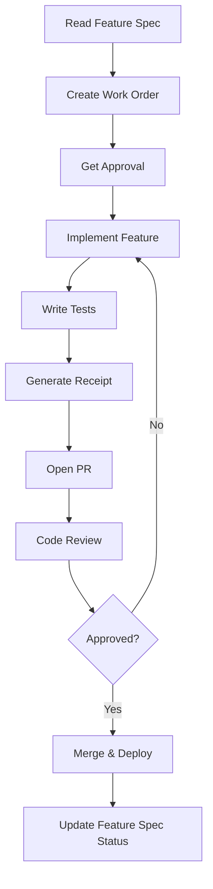

# Feature Specifications

This folder contains production-ready feature specs for all main features of the Zo World platform.

---

## Purpose

Each feature spec provides:
- **Purpose** - What problem it solves
- **API Contracts** - Request/response formats
- **DB Surface** - Database tables and fields
- **UX Notes** - User experience considerations
- **Telemetry** - Events to track
- **Acceptance Criteria** - Definition of done
- **Tests** - Test cases and examples
- **Work Order Snippet** - Ready-to-use work order template

---

## Features

### Core System Features

#### 01. Mapbox Integration
**File**: `01-mapbox-integration.md`  
**Status**: ✅ Implemented (needs optimization)  
**Owner**: Frontend / Geo

Reliable, performant map canvas showing Nodes, Events, Quests, and User location.

---

#### 02. Events System
**File**: `02-events-spec.md`  
**Status**: 🚧 Partial Implementation  
**Owner**: Events / Ops

Create, discover, RSVP, and record outcomes for rituals, dinners, workshops in Nodes.

---

#### 03. Quests System
**File**: `03-quests-spec.md`  
**Status**: ✅ Core Complete  
**Owner**: Game Systems

Core interaction primitives: one-time, recurring, location-based, audio, and social quests.

---

#### 04. Onboarding Flow
**File**: `04-onboarding-spec.md`  
**Status**: 🚧 In Progress  
**Owner**: Product / Growth

Short, high-conversion onboarding: identity, profile, avatar, tutorial quest, city selection.

---

### Quest Types

#### 05. Voice Quest (One-time)
**File**: `05-voice-quest-spec.md`  
**Status**: 🔮 Planned  
**Owner**: Game Systems / Audio

Record short audio clip as proof of presence, intention, or creative expression.

---

#### 06. Game1111 (Recurring)
**File**: `06-game1111-spec.md`  
**Status**: ✅ Core Implemented  
**Owner**: Game Systems

Recurring voice-frequency matching game (24-hour cooldown) with dynamic token rewards.

---

#### 07. Local/Global View Toggle
**File**: `07-local-global-view.md`  
**Status**: ✅ Implemented  
**Owner**: Frontend / UX

Toggle between local (nearby) and global (worldwide) map views with smart filtering and location detection.

---

## Status Legend

- ✅ **Implemented** - Feature is live in production
- 🚧 **In Progress** - Currently being developed
- 🔮 **Planned** - Spec complete, not yet started
- ⚠️ **Needs Work** - Implemented but requires improvements
- ❌ **Blocked** - Cannot proceed due to dependencies

---

## How to Use These Specs

### For AI Assistants

1. **Read the spec first** before implementing
2. **Follow the API contracts** exactly
3. **Use the work order snippet** as a starting template
4. **Implement tests** as specified
5. **Check acceptance criteria** before marking complete

### For Human Developers

1. **Start with the spec** to understand requirements
2. **Create a Work Order** in `Docs/WORK_ORDERS/`
3. **Reference the spec** during implementation
4. **Run all tests** before opening PR
5. **Update the spec** if requirements change

### For Product Managers

1. **Specs define scope** for each feature
2. **Acceptance criteria** define "done"
3. **Telemetry section** lists metrics to track
4. **UX notes** capture design decisions

---

## Feature Development Workflow



---

## Creating a New Feature Spec

Use this template:

```markdown
# Feature Name — Feature Spec

**Version**: 1.0  
**Owner**: Team / Individual  
**Last Updated**: YYYY-MM-DD  
**Status**: 🔮 Planned

---

## Purpose

What problem does this feature solve?

## Key Capabilities

- List of what it does

## API Contracts

Request/response formats

## DB Surface

Tables and fields needed

## UX Notes

User experience considerations

## Telemetry

Events to track

## Acceptance Criteria

- [ ] Criterion 1
- [ ] Criterion 2

## Tests

Test cases

## Work Order Snippet

Ready-to-use work order template
```

Save as `Docs/FEATURES/XX-feature-name.md`

---

## Linking Features

### Dependencies

Some features depend on others. Dependencies are documented in each spec.

**Example**:
- `04-onboarding-spec.md` depends on `03-quests-spec.md` (tutorial quest)
- `06-game1111-spec.md` depends on `03-quests-spec.md` (quest system)

### Cross-References

Feature specs reference:
- `Docs/API_CONTRACTS.md` - API endpoint contracts
- `Docs/DATABASE_SCHEMA.md` - Database schema
- `Docs/QUESTS_SYSTEM.md` - Quest mechanics
- `Docs/VIBE_SCORE.md` - Vibe Score integration

---

## Maintenance

### Updating Specs

When a feature changes:
1. Update the feature spec
2. Increment version number
3. Update "Last Updated" date
4. Add changelog section if major changes
5. Commit with message: `docs(features): update XX-feature-name spec`

### Archiving Specs

When a feature is deprecated:
1. Move spec to `Docs/FEATURES/archive/`
2. Update status to ❌ Deprecated
3. Add deprecation date and reason
4. Link to replacement feature (if any)

---

## Related Documentation

- `Docs/ARCHITECTURE.md` - System architecture
- `Docs/API_CONTRACTS.md` - API contracts
- `Docs/QUESTS_SYSTEM.md` - Quest system docs
- `Docs/WORK_ORDERS/README.md` - Work order process
- `Docs/LAUNDRY/README.md` - Tiny task system
- `Docs/RECEIPTS/README.md` - Receipt system

---

**Total Features**: 6  
**Status**: All specs complete  
**Last Updated**: 2025-11-13

