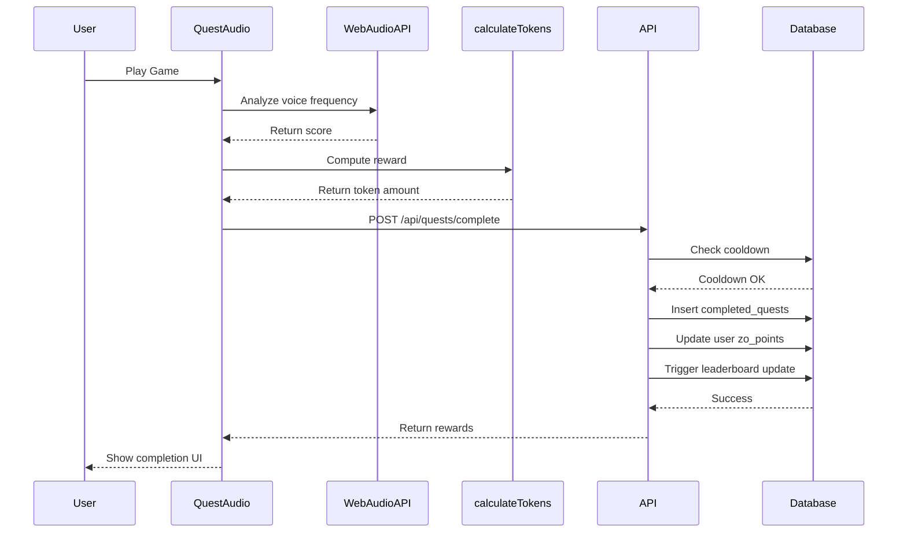

# Quest System Documentation

**Project**: Zo World Map (ZOHM)  
**Last Updated**: November 13, 2025  
**Version**: 2.0 (Post Game1111 Integration)

---

## Table of Contents

1. [Overview](#overview)
2. [Quest Types](#quest-types)
3. [Quest Mechanics](#quest-mechanics)
4. [Reward System](#reward-system)
5. [Game1111: Quantum Voice Sync](#game1111-quantum-voice-sync)
6. [Quest Verification](#quest-verification)
7. [Database Schema](#database-schema)
8. [API Integration](#api-integration)
9. [Frontend Implementation](#frontend-implementation)

---

## Overview

### Purpose

The Quest System gamifies user engagement in the Zo World ecosystem through:
- **Location-based challenges** (AR scans, check-ins)
- **Skill-based mini-games** (Game1111 voice quest)
- **Social quests** (event attendance, referrals)
- **Progress tracking** (streaks, reputation, leaderboards)

### Key Features

- ✅ **Repeatable quests** with cooldown periods
- ✅ **Dynamic rewards** based on performance
- ✅ **Multiple reward types**: Tokens, reputation, items, badges
- ✅ **Automatic leaderboard updates** via database triggers
- ✅ **Cooldown enforcement** to prevent spam
- ✅ **Location verification** for physical quests
- ✅ **Score persistence** for competitive features

---

## Quest Types

### 1. **Mini-Game Quests**

**Example**: Game1111 (Quantum Voice Sync)

**Characteristics**:
- Skill-based gameplay
- Score-dependent rewards
- Repeatable with cooldown
- Performance-based token calculation

**Flow**:
```
User plays game → Score recorded → Tokens calculated → Rewards distributed → Cooldown starts
```

---

### 2. **Location Quests**

**Example**: AR Marker Scan, Zo House Check-in

**Characteristics**:
- GPS verification required
- One-time or daily repeatability
- Physical presence proof

**Flow**:
```
User arrives at location → Scans QR/AR marker → Location verified → Rewards given
```

---

### 3. **Social Quests**

**Example**: Event Attendance, Referral Rewards

**Characteristics**:
- Community-driven
- Verification via event organizers or smart contracts
- Variable rewards based on event type

**Flow**:
```
User attends event → Organizer verifies → Quest marked complete → Reputation boost
```

---

### 4. **Progressive Quests**

**Example**: 7-Day Login Streak, Quest Completion Milestone

**Characteristics**:
- Multi-step requirements
- Tracked via `user_streaks` table
- Increasing rewards for consistency

**Flow**:
```
User completes daily action → Streak increments → Milestone checked → Bonus rewards unlocked
```

---

## Quest Mechanics

### Quest Properties

Each quest in the `quests` table has:

| Field | Type | Description |
|-------|------|-------------|
| `id` | UUID | Unique quest identifier |
| `slug` | TEXT | Human-readable ID (e.g., `game-1111-quest`) |
| `title` | TEXT | Display name |
| `description` | TEXT | Quest instructions |
| `quest_type` | TEXT | `mini_game`, `location`, `social`, `progressive` |
| `reward` | INTEGER | Base $ZO token reward |
| `rewards_breakdown` | JSONB | Detailed rewards (tokens, reputation, items) |
| `cooldown_hours` | INTEGER | Hours until quest can be repeated (0 = one-time) |
| `is_repeatable` | BOOLEAN | Can quest be done multiple times? |
| `verification_type` | TEXT | `auto`, `manual`, `gps`, `contract` |
| `difficulty` | TEXT | `easy`, `medium`, `hard`, `expert` |
| `is_active` | BOOLEAN | Is quest currently available? |

---

### Cooldown System

**Purpose**: Prevent spam and ensure balanced token distribution.

**Logic**:
1. User completes quest at time `T`
2. Next attempt blocked until `T + cooldown_hours`
3. Cooldown checked before quest submission in `/api/quests/complete`

**Database Check**:
```sql
SELECT completed_at 
FROM completed_quests 
WHERE user_id = $1 
  AND quest_id = $2 
ORDER BY completed_at DESC 
LIMIT 1;

-- If completed_at + cooldown_hours > NOW(), reject with 429 status
```

**Example**: Game1111 has `cooldown_hours: 24`
- User completes at `2025-11-13 10:00 AM`
- Next attempt allowed at `2025-11-14 10:00 AM`

---

### Repeatability

**Repeatable Quests** (`is_repeatable: true`):
- Can be completed multiple times
- Subject to cooldown
- Examples: Game1111, daily check-ins

**One-Time Quests** (`is_repeatable: false`):
- Can only be completed once per user
- No cooldown (already impossible to repeat)
- Examples: Onboarding quests, tutorial completion

---

## Reward System

### Reward Types

**1. $ZO Tokens** (Primary Currency)
- Used for: Leaderboard ranking, city contributions, governance
- Stored in: `users.zo_points`
- Distribution: Automatic upon quest completion

**2. Reputation Points**
- Four categories: **Builder**, **Connector**, **Explorer**, **Pioneer**
- Stored in: `user_reputations` table
- Effect: Unlocks special badges and perks

**3. Items & Badges**
- Collectibles stored in `user_inventory`
- Types: Badges, NFTs, consumables
- Display: Profile showcase, achievements page

**4. Streak Bonuses**
- Multiplier for consecutive completions
- Types: Login, quest, event, checkin streaks
- Stored in: `user_streaks` table

---

### Rewards Breakdown Structure

Quests can have complex reward structures via `rewards_breakdown` JSONB:

```json
{
  "zo_tokens": 100,
  "reputation": {
    "explorer": 10,
    "builder": 5
  },
  "items": [
    {
      "item_type": "badge",
      "item_id": "voice_master",
      "quantity": 1
    }
  ],
  "streak_bonus": {
    "enabled": true,
    "multiplier": 1.5
  }
}
```

---

## Game1111: Quantum Voice Sync

### Overview

**Game1111** is the flagship voice-based mini-game where users match a target frequency (1111 Hz) using their voice.

**Lore**: *"In the Zo Protocol, harmony isn't just heard—it's felt. Channel your voice to sync with the quantum frequency of 1111 Hz and earn your place among the resonators."*

---

### Gameplay Mechanics

**Objective**: Get as close to 1111 Hz as possible

**Controls**:
- User speaks/hums into microphone
- Real-time frequency analysis (Web Audio API)
- Visual feedback with neon rings
- 10-second time limit

**Scoring**:
- Perfect score: `1111` (exactly on target)
- Score range: `0 - 2222` (distance from 1111)
- Formula: `score = Math.abs(userFrequency - 1111)`

---

### Dynamic Token Calculation

**Core Formula**:
```javascript
function calculateTokensEarned(score) {
  const distance = Math.abs(1111 - score);
  
  // Perfect score: 100 tokens
  if (distance === 0) return 100;
  
  // Within 10 Hz: 80-99 tokens
  if (distance <= 10) {
    return Math.floor(100 - distance);
  }
  
  // Within 50 Hz: 50-80 tokens
  if (distance <= 50) {
    return Math.floor(80 - (distance - 10) * 0.75);
  }
  
  // Within 100 Hz: 20-50 tokens
  if (distance <= 100) {
    return Math.floor(50 - (distance - 50) * 0.6);
  }
  
  // Beyond 100 Hz: 5-20 tokens (consolation)
  return Math.max(5, Math.floor(20 - (distance - 100) * 0.1));
}
```

**Examples**:
| User Score | Distance | Tokens | Performance |
|------------|----------|--------|-------------|
| 1111 | 0 | 100 | Perfect! |
| 1105 | 6 | 94 | Excellent |
| 1095 | 16 | 84 | Great |
| 1070 | 41 | 57 | Good |
| 1050 | 61 | 33 | Fair |
| 1000 | 111 | 18 | Try again |
| 500 | 611 | 5 | Consolation |

---

### Win Condition

**Binary Win**:
```javascript
const hasWon = Math.abs(1111 - score) <= 50;
```

- **Won**: Distance ≤ 50 Hz (score between 1061-1161)
- **Lost**: Distance > 50 Hz

**Why 50 Hz?**
- Achievable with practice
- Not too easy (prevents token farming)
- Balances skill vs. luck

---

### Quest Completion Flow



---

### Database Integration

**Quest Record** (in `quests` table):
```sql
INSERT INTO quests (slug, title, quest_type, cooldown_hours, rewards_breakdown)
VALUES (
  'game-1111-quest',
  'Quantum Voice Sync',
  'mini_game',
  24, -- 24-hour cooldown
  '{
    "zo_tokens": null,
    "reputation": { "explorer": 5 },
    "items": []
  }'::jsonb
);
```

**Completion Record** (in `completed_quests` table):
```sql
INSERT INTO completed_quests (
  user_id, 
  quest_id, 
  score, 
  reward_amount, 
  location, 
  metadata
) VALUES (
  'did:privy:xxx',
  'uuid-of-game1111-quest',
  1095,
  84,
  'webapp',
  '{
    "quest_title": "Quantum Voice Sync",
    "completed_via": "webapp",
    "game_won": true,
    "reward_zo": 84
  }'::jsonb
);
```

---

## Quest Verification

### Verification Types

**1. Auto-Verification** (`verification_type: 'auto'`)
- No additional proof needed
- Used for: Mini-games, automated quests
- Example: Game1111 (score is proof)

**2. GPS Verification** (`verification_type: 'gps'`)
- Requires latitude/longitude within geofence
- Used for: Location quests, check-ins
- Example: Zo House AR scan

**3. Manual Verification** (`verification_type: 'manual'`)
- Admin/organizer approval required
- Used for: Events, referrals
- Example: Conference attendance

**4. Contract Verification** (`verification_type: 'contract'`)
- On-chain proof via smart contract
- Used for: NFT-gated quests, Web3 actions
- Example: Founder Pass holder quests

---

### GPS Verification Example

```typescript
// Check if user is within 100m of target location
function verifyLocation(
  userLat: number,
  userLon: number,
  targetLat: number,
  targetLon: number,
  radiusMeters: number = 100
): boolean {
  const distance = haversineDistance(
    userLat, userLon, 
    targetLat, targetLon
  );
  return distance <= radiusMeters;
}

// Haversine formula for Earth surface distance
function haversineDistance(
  lat1: number, lon1: number,
  lat2: number, lon2: number
): number {
  const R = 6371e3; // Earth radius in meters
  const φ1 = lat1 * Math.PI / 180;
  const φ2 = lat2 * Math.PI / 180;
  const Δφ = (lat2 - lat1) * Math.PI / 180;
  const Δλ = (lon2 - lon1) * Math.PI / 180;

  const a = Math.sin(Δφ/2) * Math.sin(Δφ/2) +
            Math.cos(φ1) * Math.cos(φ2) *
            Math.sin(Δλ/2) * Math.sin(Δλ/2);
  const c = 2 * Math.atan2(Math.sqrt(a), Math.sqrt(1-a));

  return R * c; // Distance in meters
}
```

---

## Database Schema

### `quests` Table

```sql
CREATE TABLE quests (
  id UUID PRIMARY KEY DEFAULT uuid_generate_v4(),
  slug TEXT UNIQUE NOT NULL,
  title TEXT NOT NULL,
  description TEXT,
  quest_type TEXT NOT NULL,
  reward INTEGER DEFAULT 0,
  rewards_breakdown JSONB,
  cooldown_hours INTEGER DEFAULT 0,
  is_repeatable BOOLEAN DEFAULT false,
  verification_type TEXT DEFAULT 'auto',
  difficulty TEXT DEFAULT 'medium',
  is_active BOOLEAN DEFAULT true,
  created_at TIMESTAMP DEFAULT NOW(),
  updated_at TIMESTAMP DEFAULT NOW()
);
```

---

### `completed_quests` Table

```sql
CREATE TABLE completed_quests (
  id UUID PRIMARY KEY DEFAULT uuid_generate_v4(),
  user_id TEXT NOT NULL REFERENCES users(id),
  quest_id UUID NOT NULL REFERENCES quests(id),
  score INTEGER,
  reward_amount INTEGER NOT NULL,
  location TEXT,
  latitude DECIMAL(10, 8),
  longitude DECIMAL(11, 8),
  completed_at TIMESTAMP DEFAULT NOW(),
  metadata JSONB
);

CREATE INDEX idx_completed_quests_user_quest 
  ON completed_quests(user_id, quest_id);
CREATE INDEX idx_completed_quests_completed_at 
  ON completed_quests(completed_at DESC);
```

---

### Automatic Leaderboard Update Trigger

```sql
CREATE OR REPLACE FUNCTION update_leaderboard_on_quest_complete()
RETURNS TRIGGER AS $$
BEGIN
  -- Update user's total zo_points
  UPDATE users
  SET zo_points = zo_points + NEW.reward_amount,
      updated_at = NOW()
  WHERE id = NEW.user_id;
  
  -- Upsert leaderboard entry
  INSERT INTO leaderboards (user_id, zo_points, rank)
  VALUES (
    NEW.user_id,
    (SELECT zo_points FROM users WHERE id = NEW.user_id),
    (SELECT COUNT(*) + 1 FROM users WHERE zo_points > 
      (SELECT zo_points FROM users WHERE id = NEW.user_id))
  )
  ON CONFLICT (user_id) DO UPDATE
  SET zo_points = EXCLUDED.zo_points,
      rank = EXCLUDED.rank,
      updated_at = NOW();
  
  RETURN NEW;
END;
$$ LANGUAGE plpgsql;

CREATE TRIGGER trigger_update_leaderboard
  AFTER INSERT ON completed_quests
  FOR EACH ROW
  EXECUTE FUNCTION update_leaderboard_on_quest_complete();
```

---

## API Integration

### Quest Completion Endpoint

**Route**: `POST /api/quests/complete`

**Implementation** (`apps/web/src/app/api/quests/complete/route.ts`):

```typescript
export async function POST(request: NextRequest) {
  const { user_id, quest_id, score, location, metadata } = await request.json();
  
  // 1. Validate inputs
  if (!user_id || !quest_id) {
    return NextResponse.json({ error: 'Missing required fields' }, { status: 400 });
  }
  
  // 2. Fetch quest details
  const quest = await supabase
    .from('quests')
    .select('*')
    .eq('slug', quest_id)
    .single();
  
  // 3. Check cooldown
  if (quest.cooldown_hours > 0) {
    const canComplete = await canUserCompleteQuest(
      user_id, 
      quest.id, 
      quest.cooldown_hours
    );
    if (!canComplete) {
      return NextResponse.json(
        { error: 'Quest is on cooldown' }, 
        { status: 429 }
      );
    }
  }
  
  // 4. Calculate rewards
  const tokensEarned = calculateTokensEarned(score); // Dynamic calculation
  
  // 5. Record completion
  await recordQuestScore(
    user_id, 
    quest.id, 
    score, 
    location, 
    tokensEarned
  );
  
  // 6. Return success + next available time
  return NextResponse.json({
    success: true,
    rewards: { zo_tokens: tokensEarned },
    next_available_at: calculateNextAvailableTime(quest.cooldown_hours)
  });
}
```

---

## Frontend Implementation

### Game1111 Integration

**File**: `apps/web/src/components/QuestAudio.tsx`

**Key Changes Needed**:

```typescript
// Add token calculation function
function calculateTokensEarned(score: number): number {
  const distance = Math.abs(1111 - score);
  if (distance === 0) return 100;
  if (distance <= 10) return Math.floor(100 - distance);
  if (distance <= 50) return Math.floor(80 - (distance - 10) * 0.75);
  if (distance <= 100) return Math.floor(50 - (distance - 50) * 0.6);
  return Math.max(5, Math.floor(20 - (distance - 100) * 0.1));
}

// Wire up onWin callback
onWin={async (score, hasWon) => {
  const tokensEarned = calculateTokensEarned(score);
  
  try {
    const response = await fetch('/api/quests/complete', {
      method: 'POST',
      headers: { 'Content-Type': 'application/json' },
      body: JSON.stringify({
        user_id: userId,
        quest_id: 'game-1111-quest',
        score: score,
        location: 'webapp',
        metadata: {
          quest_title: 'Quantum Voice Sync',
          completed_via: 'webapp',
          game_won: hasWon,
          reward_zo: tokensEarned
        }
      })
    });
    
    const data = await response.json();
    
    if (data.success) {
      onComplete(score, data.rewards.zo_tokens);
    } else if (data.error === 'Quest is on cooldown') {
      showCooldownMessage(data.next_available_at);
    }
  } catch (error) {
    console.error('Quest save failed:', error);
    onComplete(score, tokensEarned); // Continue anyway
  }
}}
```

---

## Future Enhancements

### Planned Features

**1. Quest Chains** 🔮
- Multi-step quests with dependencies
- Example: "Complete Game1111 → Attend event → Refer friend"

**2. Dynamic Difficulty Adjustment** 🔮
- Harder quests for experienced users
- Adaptive rewards based on skill level

**3. Collaborative Quests** 🔮
- Team-based challenges
- Shared rewards for city communities

**4. Seasonal Events** 🔮
- Limited-time quests with exclusive rewards
- Holiday-themed challenges

**5. Quest Marketplace** 🔮
- User-created quests (with DAO approval)
- Token staking for quest creation

---

## Related Documentation

- `API_ENDPOINTS.md` - API reference for quest endpoints
- `TOKEN_ECONOMICS.md` - $ZO token distribution and sinks
- `DATABASE_SCHEMA.md` - Complete database reference
- `GAME1111_TECHNICAL_DOCUMENTATION.md` - Detailed Game1111 mechanics
- `ONBOARDING_FLOW.md` - User journey including first quest

