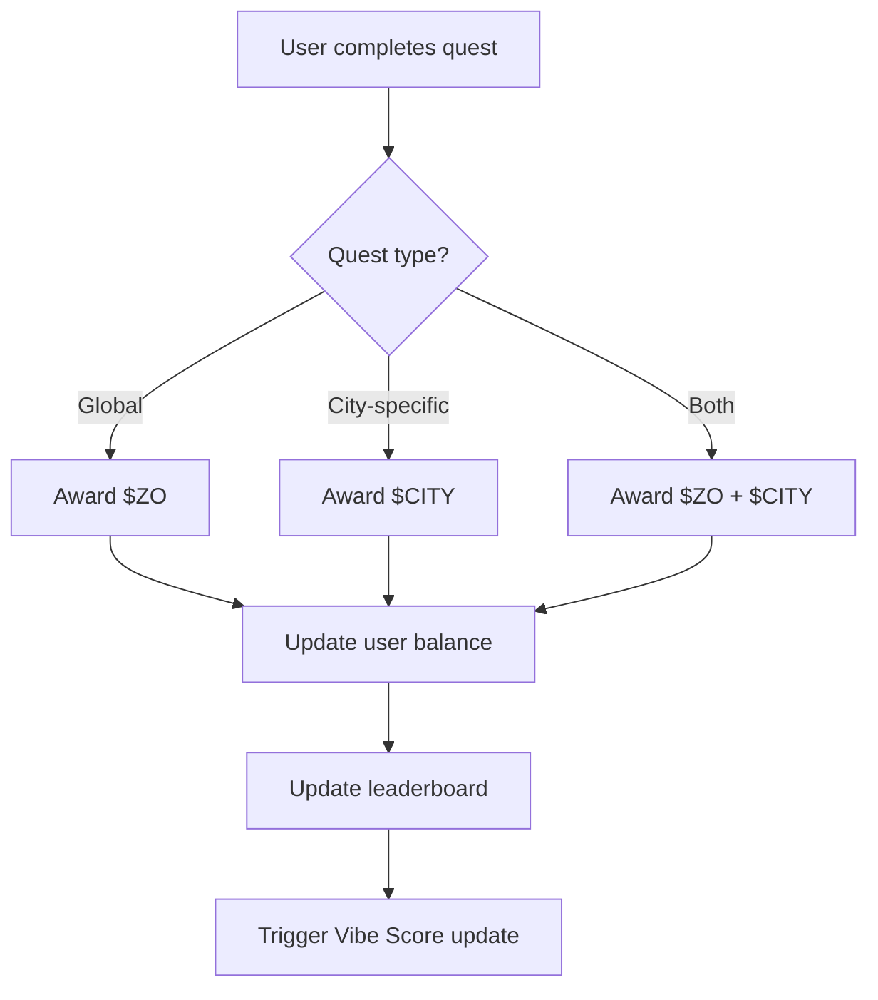
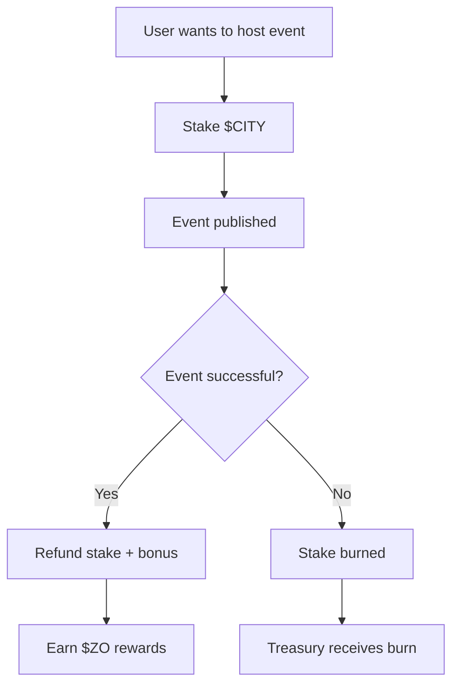
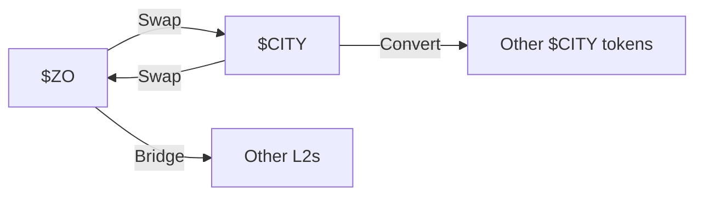

# Token Economics - $ZO & $CITY

**Version**: 1.0  
**Last Updated**: 2025-11-13  
**Status**: 🚧 In Development

---

## Table of Contents

1. [Overview](#overview)
2. [$ZO Token](#zo-token)
3. [$CITY Token](#city-token)
4. [Token Flows](#token-flows)
5. [Distribution](#distribution)
6. [Sinks & Burns](#sinks--burns)
7. [Governance](#governance)
8. [Economics Model](#economics-model)

---

## Overview

Zo World uses a dual-token economy:
- **$ZO** - Global reputation and rewards token
- **$CITY** - City-specific governance and contribution token

### Design Principles

1. **Earn through contribution** - Tokens reward meaningful participation
2. **Spend for influence** - Tokens enable governance and privileges
3. **Burn for scarcity** - Token sinks create deflationary pressure
4. **City autonomy** - Each city can customize its economy

---

## $ZO Token

### Purpose

**$ZO** is the global reputation currency of the Zo Protocol.

**Primary Uses**:
- Global leaderboard ranking
- Cross-city reputation portability
- Founder Pass holder benefits
- Protocol governance (future)
- Premium features unlock

### Supply

**Initial Supply**: TBD  
**Max Supply**: TBD (or infinite with controlled emission)  
**Distribution**: See [Distribution](#distribution) section

### Earning $ZO

#### Quest Completion
```typescript
// Dynamic rewards based on performance
Game1111: 5-100 $ZO per completion (24h cooldown)
Voice Quest: 30-50 $ZO (one-time)
Location Quest: 20-40 $ZO per check-in
Event Attendance: 25-75 $ZO per event
Social Quest: 15-50 $ZO per completion
```

#### Vibe Score Multipliers
```typescript
// Users with high Vibe Scores earn bonuses
if (vibeScore >= 80) {
  reward *= 1.5;  // 50% bonus
} else if (vibeScore >= 60) {
  reward *= 1.25; // 25% bonus
}
```

#### Streak Bonuses
```typescript
// Consecutive activity increases rewards
Login Streak (7 days): +10% $ZO on all quests
Quest Streak (5 days): +15% $ZO on quest rewards
Event Streak (3 events): +20% $ZO on next event
```

#### Reputation Milestones
```typescript
// Reaching reputation levels awards $ZO
Explorer Level 5: 500 $ZO
Builder Level 5: 500 $ZO
Connector Level 5: 500 $ZO
Pioneer Level 5: 500 $ZO
```

### Spending $ZO

#### Premium Features (Future)
- Unlock exclusive quests: 100-500 $ZO
- Create custom quests: 1000 $ZO
- Host events: 200 $ZO
- Custom avatar traits: 50-200 $ZO

#### Governance (Future)
- Vote on protocol proposals: 1 $ZO = 1 vote
- Propose features: 10,000 $ZO stake
- Veto proposals: 50,000 $ZO stake

#### Tipping & Gifting
- Tip other users: 1-1000 $ZO
- Gift quest rewards: Any amount
- Support creators: Any amount

### $ZO Token Contract

**Blockchain**: Base (Ethereum L2)  
**Contract Type**: ERC-20  
**Contract Address**: TBD (not yet deployed)

```solidity
// packages/contracts/contracts/ZOToken.sol
contract ZOToken is ERC20 {
    // Standard ERC-20 implementation
    // Admin mint for quest rewards
    // Burn mechanism for sinks
}
```

---

## $CITY Token

### Purpose

**$CITY** tokens represent city-specific contribution and governance.

**Each city has its own $CITY token**:
- San Francisco: $SF
- New York: $NYC
- Los Angeles: $LA
- Etc.

**Primary Uses**:
- City-level governance
- Local event access
- Node priority access
- City treasury funding

### Supply (Per City)

**Initial Supply**: 1,000,000 $CITY per city  
**Distribution**:
- 40% - Community treasury
- 30% - Early contributors
- 20% - Protocol reserve
- 10% - Founder Pass holders

### Earning $CITY

#### City-Specific Actions
```typescript
// Earn $CITY for contributing to your home city
Attend local event: 10-50 $CITY
Host local event: 100-500 $CITY
Create city content: 25-100 $CITY
Refer local member: 50 $CITY
```

#### City Progress Contributions
```typescript
// Contributing to city milestones
City population goal: 1000 $CITY (split among contributors)
City activity goal: 500 $CITY (split among contributors)
City quest completion: 200 $CITY (split among top 10)
```

#### Node Activation
```typescript
// First users to activate a new node
First to check in: 500 $CITY
First to host event: 300 $CITY
First to complete quest: 200 $CITY
```

### Spending $CITY

#### Event Priority Access
- Premium event tickets: 50-200 $CITY
- Host booth at event: 500 $CITY
- Featured speaker slot: 1000 $CITY

#### Node Benefits
- Priority room booking: 100 $CITY/night
- Workspace reservation: 50 $CITY/day
- Equipment rental: 25 $CITY/hour

#### City Governance
- Vote on city proposals: 1 $CITY = 1 vote
- Propose city initiatives: 1000 $CITY stake
- Veto city decisions: 5000 $CITY stake

### $CITY Contracts

**Blockchain**: Base  
**Contract Type**: ERC-20 (one per city)  
**Factory**: CityTokenFactory.sol

```solidity
// packages/contracts/contracts/CityToken.sol
contract CityToken is ERC20 {
    string public cityName;
    address public cityGovernor;
    
    // City-specific minting rules
    // Treasury management
}
```

---

## Token Flows

### Quest Completion Flow



### Event Hosting Flow



### Token Exchange (Future)



---

## Distribution

### $ZO Distribution Plan

**Phase 1: Bootstrap (Months 1-6)**
- 70% - Quest rewards (daily emission)
- 15% - Founder Pass holders (airdrop)
- 10% - Protocol treasury
- 5% - Team & contributors

**Phase 2: Growth (Months 7-12)**
- 60% - Quest rewards (reduced emission)
- 20% - Ecosystem grants
- 15% - Protocol treasury
- 5% - Team & contributors

**Phase 3: Maturity (Month 13+)**
- 50% - Quest rewards (steady emission)
- 25% - Ecosystem grants
- 15% - Protocol treasury
- 10% - Staking rewards

### Daily Emission Schedule

```typescript
// $ZO daily emission (example)
Month 1-3:   10,000 $ZO/day
Month 4-6:   8,000 $ZO/day
Month 7-12:  5,000 $ZO/day
Month 13-24: 3,000 $ZO/day
Month 25+:   2,000 $ZO/day
```

### $CITY Distribution (Per City)

**At City Launch**:
- Airdrop to first 100 members: 500 $CITY each
- Treasury: 400,000 $CITY
- Protocol reserve: 200,000 $CITY
- Early contributors: 300,000 $CITY

**Ongoing Emission**:
- City quests: 100-1000 $CITY/day (based on activity)
- Event rewards: 50-500 $CITY/event
- Growth incentives: Variable

---

## Sinks & Burns

### $ZO Sinks

**Quest Creation**:
- Create custom quest: 1000 $ZO (burned)
- Feature quest on map: 500 $ZO (burned)

**Governance**:
- Failed proposals: Stake burned (10,000 $ZO)
- Malicious voting: Slashed (variable)

**Premium Features**:
- Unlock avatar traits: 50-200 $ZO (50% burned, 50% treasury)
- Unlock exclusive content: 100 $ZO (burned)

**Liquidity Provision** (Future):
- Provide $ZO/$CITY liquidity: Earn fees
- Withdraw early: 5% burn penalty

### $CITY Sinks

**Failed Events**:
- Event cancellation: Stake burned
- Low attendance: Partial burn

**Node Services**:
- Service fees: 30% burned, 70% to node
- Cancellation penalties: 100% burned

**Governance Spam**:
- Failed proposals: Stake burned
- Vote manipulation: Tokens slashed

### Burn Visualization

```typescript
// Running 30-day burn totals
$ZO Burned:   ~50,000 tokens/month (example)
$CITY Burned: ~5,000 tokens/city/month (example)

// Burn sources
Quest creation: 35%
Governance: 25%
Service fees: 20%
Failed events: 15%
Other: 5%
```

---

## Governance

### Protocol Governance ($ZO)

**Voting Power**:
- 1 $ZO = 1 vote
- Minimum 100 $ZO to propose
- Minimum 10,000 $ZO to create formal proposal

**Proposal Types**:
1. **Parameter Changes** - Quest rewards, cooldowns, etc.
2. **Feature Additions** - New quest types, new features
3. **Treasury Allocation** - Ecosystem grants, partnerships
4. **Emergency Actions** - Pause contracts, fix exploits

**Voting Process**:
```
1. Discussion (7 days)
2. Formal proposal (requires 10,000 $ZO stake)
3. Voting period (7 days)
4. Execution (if passed with >50% approval)
```

### City Governance ($CITY)

**Voting Power**:
- 1 $CITY = 1 vote in that city
- Minimum 10 $CITY to propose
- Minimum 1,000 $CITY to create formal proposal

**City Proposal Types**:
1. **Event Curation** - Approve/reject proposed events
2. **Treasury Spending** - Fund local initiatives
3. **Node Operations** - Open new nodes, close old ones
4. **City Parameters** - Adjust emission rates, fees

**Example City Vote**:
```
Proposal: Should SF host monthly community dinner?
- Yes votes: 45,000 $SF
- No votes: 15,000 $SF
- Result: PASSED ✅
- Treasury allocation: 5,000 $SF/month for dinners
```

---

## Economics Model

### Token Velocity

**Target $ZO Velocity**: 3-5x per year
- Tokens earned and spent 3-5 times annually
- Balanced by sinks and holding incentives

**Target $CITY Velocity**: 1-2x per year
- Tokens primarily held for governance
- Lower velocity = more stable governance

### Value Accrual

**$ZO Value Drivers**:
1. Global network effects (more users = more utility)
2. Premium feature demand
3. Governance participation
4. Deflationary pressure from burns

**$CITY Value Drivers**:
1. City-specific network effects
2. Node access demand
3. Event quality and frequency
4. Treasury strength

### Supply Dynamics

```typescript
// Simplified model
totalSupply(t) = initialSupply + emission(t) - burned(t)

// Target equilibrium
emission(t) ≈ burned(t) after 24 months

// Deflationary after maturity
emission(t) < burned(t) after 36 months
```

### Price Discovery (Future)

**When tokens launch on DEX**:
- Initial liquidity: Protocol-owned liquidity (POL)
- Price discovery: AMM (Uniswap v3 on Base)
- Liquidity incentives: $ZO/$ETH pool rewards

**Target Ratios**:
- $ZO/$CITY: 10:1 (one $ZO = 10 $CITY on average)
- Varies by city activity and demand

---

## Implementation Status

### Current (v1.0)
- ✅ $ZO points tracked in database (not on-chain)
- ✅ Quest rewards calculated
- ✅ Leaderboard rankings
- ❌ Tokens not yet deployed on-chain
- ❌ No token contracts
- ❌ No governance

### Planned (v2.0)
- [ ] Deploy $ZO token contract on Base
- [ ] Deploy CityTokenFactory contract
- [ ] Migrate database points to on-chain tokens
- [ ] Implement governance contracts
- [ ] Launch liquidity pools
- [ ] Enable token swaps

### Timeline
- **Q1 2026**: Deploy contracts to Base testnet
- **Q2 2026**: Community testing and audits
- **Q3 2026**: Mainnet deployment
- **Q4 2026**: Full governance launch

---

## Related Documentation

- `ARCHITECTURE.md` - System architecture
- `QUESTS_SYSTEM.md` - Quest rewards and mechanics
- `VIBE_SCORE.md` - Vibe Score multipliers
- `DATABASE_SCHEMA.md` - `users.zo_points` field
- `packages/contracts/` - Token contracts (future)

---

## Risks & Mitigation

### Economic Risks

**Risk**: Hyperinflation from excessive emission  
**Mitigation**: Gradual emission reduction, robust sinks

**Risk**: Token manipulation / farming  
**Mitigation**: Cooldowns, verification, anomaly detection

**Risk**: Low liquidity  
**Mitigation**: Protocol-owned liquidity, incentives

### Governance Risks

**Risk**: Whale voting dominance  
**Mitigation**: Quadratic voting (future), delegation

**Risk**: Low participation  
**Mitigation**: Snapshot voting (gasless), incentives

**Risk**: Governance attacks  
**Mitigation**: Time locks, emergency pause, multi-sig

---

**Document Version**: 1.0  
**Last Updated**: 2025-11-13  
**Status**: 🚧 Design Phase - Not Yet Deployed  
**Next Review**: When preparing for token launch

