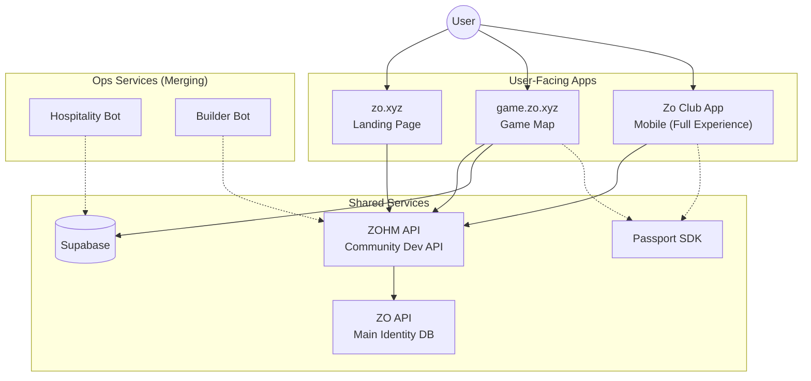

# Zo OS / Zo Protocol

> **An interconnected suite of open source tools that form the operating system for networked physical communities.**

**Zo OS** and **Zo Protocol** are the same thing — different names for the same system. "Protocol" emphasizes the rules and coordination layer. "OS" emphasizes the tools and technical stack. Use whichever fits the context.

---

## Product Architecture

Zo World is built as **three user-facing surfaces** backed by **three supporting services**.

```
                    ┌─────────────────────────────────────┐
                    │           USER-FACING APPS           │
                    │                                     │
  zo.xyz            │   Landing Page (front door)         │ ← Nx monorepo, 10+ apps
  game.zo.xyz       │   Game Map (navigation + action)     │ ← Next.js 15, Supabase, Mapbox
  Zo Club App       │   Mobile App (full experience)      │ ← React Native, all-inclusive
                    └────────────────┬────────────────────┘
                                     │
                    ┌────────────────┴────────────────────┐
                    │         SUPPORTING SERVICES          │
                    │                                     │
  Passport SDK      │   Identity & auth (npm package)     │ ← Shared across web + mobile
  Hospitality Bot   │   Property ops automation           │ ← Merging into main builds
  Builder Bot       │   Community contributor tracking    │ ← Merging into main builds
                    └─────────────────────────────────────┘
```

### The Vision

**One build, two platforms.** The three supporting services are being consolidated into the web and mobile codebases. Passport SDK is already a shared dependency. Hospitality Bot and Builder Bot will merge as internal services rather than standalone repos.

---

## User-Facing Apps

### 1. [zo.xyz — Landing Page](./projects/WEB_PLATFORM.md)

**Repository**: [github.com/ZoHouse/zo.xyz](https://github.com/ZoHouse/zo.xyz)

The **front door** to Zo World. An Nx monorepo hosting the public website, admin panel, PMS, payment portal, and operations dashboards. This is where new users discover Zo World before entering the game.

**Stack**: Nx + Next.js 14 + React 18 + Yarn
**Role**: Marketing, admin, property management, operations

### 2. [game.zo.xyz — Game Map](./projects/QUESTING_MAP.md)

**Repository**: [github.com/ZoHouse/zohm](https://github.com/ZoHouse/zohm)

The **navigation and action layer** of Zo World. The interactive 3D map is how users discover nodes, find events, connect with citizens, and complete quests. Everything in Zo World has a place on the map.

**Stack**: Next.js 15 + React 19 + Supabase + Mapbox + AssemblyAI
**Role**: Navigation, questing, events, identity, governance

### 3. [Zo Club App — Mobile](./projects/MOBILE_APP.md)

**Repository**: [github.com/ZoHouse/ZoWorldmobile](https://github.com/ZoHouse/ZoWorldmobile)

The **all-inclusive mobile experience**. Everything from the web game plus IRL bookings, real-time chat, Razorpay payments, Web3 wallet, and the ZUI design system. This is the full Zo World experience in your pocket.

**Stack**: React Native 0.73.6 + TypeScript + NativeBase + ZUI
**Role**: Full experience — questing, bookings, chat, wallet, events

---

## Supporting Services (Merging Into Main Builds)

### 4. [Zo Passport SDK](./projects/PASSPORT_SDK.md)

**Repository**: [github.com/ZoHouse/zopassport](https://github.com/ZoHouse/zopassport)
**NPM**: `npm install zopassport`

Shared identity and authentication SDK used by both web and mobile. Phone OTP login, avatar generation, passport card UI, and wallet management. Already a dependency — stays as a shared package.

### 5. [Hospitality Bot](./projects/HOSPITALITY_BOT.md)

**Repository**: [github.com/ZoHouse/Hospitality-2.0](https://github.com/ZoHouse/Hospitality-2.0)

LangGraph-powered property operations automation. Currently a standalone Python/FastAPI service — consolidating into the main web platform as an internal service.

### 6. [Builder Bot](./projects/BUILDER_BOT.md)

**Repository**: [github.com/ZoHouse/ZoBuilder-bot](https://github.com/ZoHouse/ZoBuilder-bot)

Telegram bot for tracking GitHub contributions and Builder Score. Currently standalone Python — consolidating into the main platform.

---

## Architecture Diagram



---

## Contributing

These projects are open source. We invite contributors to help us build the operating system for the next generation of physical communities.

The primary contribution targets are:
- **game.zo.xyz (zohm)** — Core web experience
- **Zo Club App** — Core mobile experience
- **Passport SDK** — Shared identity layer
