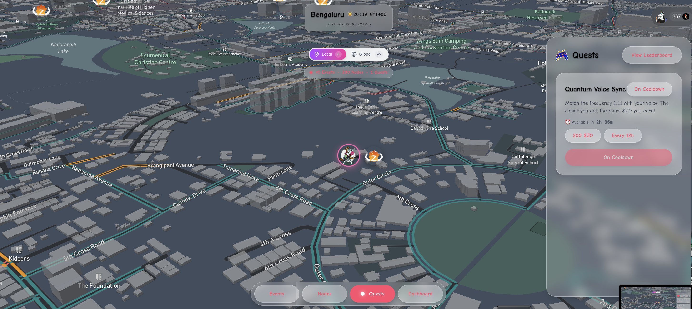

<div align="center">

# 🌐 Zo World

### *A Life Design Simulation Engine*

**Live consciously. Create intentionally. Sync with your highest timeline.**

[](https://opensource.org/licenses/MIT)
[](https://nextjs.org/)
[](https://www.typescriptlang.org/)
[](https://vercel.com)

[Website](https://zo.xyz) • [Documentation](./Docs/README.md) • [Protocol Lore](./lore/zo_protocol_lore.md)

</div>

---

## 🎯 What is Zo World?

Zo World is a **decentralized protocol for conscious reality design** — a programmable layer that overlays default reality and transforms everyday life into an intentional simulation.

It's not a brand, not a community product, and not a traditional network. **It's a field. A frequency. A self-reinforcing system** built around alignment, agency, creativity, and transformation.

Within Zo World, every action is a signal. Every signal affects the field. The field responds with new opportunities, interactions, and narrative shifts. This recursive loop forms the basis of our **Life Design Simulation Engine** that guides people toward aligned timelines.

<div align="center">

<p><em>The Zo World Dashboard - Your command center for reality design</em></p>
</div>

---

## ✨ Core Features

### 🎫 Zo Passport - Digital Identity System
Dynamic identity with progression from **Citizen** to **Founder**. Track your completion, declare your timeline, and showcase your evolution.

<div align="center">

</div>

**Features:**
- Real-time profile completion tracking (10 fields)
- Social declaration system for timeline commitment
- Glassmorphism design with smooth animations
- Mobile-responsive interface
- Progression visualization from Citizen to Founder

---

### 📊 Vibe Score - Reality Alignment Metric
Your real-time alignment percentage computed from multidimensional life signals.

<div align="center">

</div>

**How it works:**
- **Real-time computation** (0-100% alignment)
- Factors: Node presence, Quest completion, Social connections, Creative output
- Explainable and auditable algorithm
- Dynamic updates based on your behavior
- Leaderboard rankings

---

### 🗺️ Interactive Node Map
3D visualization of global Zo Nodes - physical spaces as programmable reality portals.

<div align="center">

</div>

**Capabilities:**
- **3D Mapbox-powered visualization** of all nodes
- Real-time location tracking and discovery
- **Zostel Network integration** - 50+ locations across India
- Node resonance and presence tracking
- Physical spaces that amplify the field

---

### 🎮 Quest System - Reality Programs
Structured quests that generate meaningful life signals and earn zo token rewards.

<div align="center">

</div>

**Quest Types:**
- **Social**: Community connections and events
- **Creative**: Content creation and sharing
- **Physical**: Location-based and node presence
- **Digital**: On-chain and verification-based

**Rewards:**
- Token rewards ($ZO) for completion
- Blockchain verification and proofs
- Real-time progress tracking
- Leaderboard rankings

---

### 🏠 Zo Houses & Nodes
Physical infrastructure as cultural routers connecting the network.

**Locations:**
- 🇮🇳 **Zo House Bangalore** - Flagship location
- 🇺🇸 **Zo House San Francisco** - West Coast hub
- 🏨 **Zostel Network** - 50+ partner hostels across India
- 🌍 **Community Nodes** - User-created locations worldwide

---

### 🎨 Additional Systems

**Culture System**
- Declare your cultures: Design, Food, Science & Tech, and more
- Culture-based matching and community formation
- Real-time culture feed and interactions

**Quantum Sync - Voice Quest**
- Audio-based reality tuning experience
- Real-time voice analysis with AssemblyAI
- Gamified voice quest with token rewards
- Mobile-first interface with biometric auth

---

## 🏗️ Architecture

Zo World is built as a **monorepo** with modular packages for scalability and maintainability.

```
zohm/
├── apps/
│   └── web/              # Next.js 15 web application
├── packages/
│   ├── api/              # Database migrations and API utilities
│   ├── contracts/        # Smart contracts (ERC-20 tokens)
│   ├── sdk/              # Shared TypeScript SDK and types
│   └── shared/           # Shared utilities
├── Docs/                 # Complete documentation
├── lore/                 # Protocol lore and ontology
└── scripts/              # Database and automation scripts
```

### Tech Stack

- **Frontend**: Next.js 15, React 19, TypeScript 5, Tailwind CSS
- **Backend**: Next.js API Routes, Supabase (PostgreSQL)
- **Authentication**: ZO API (phone + OTP)
- **Blockchain**: Base (L2), Avalanche Fuji (testnet)
- **Maps**: Mapbox GL JS (3D visualization)
- **Real-time**: Supabase Realtime subscriptions
- **AI/ML**: AssemblyAI (voice), OpenAI (narrative generation)
- **Deployment**: Vercel (production), GitHub Actions (CI/CD)

---

## 🚀 Getting Started

### Prerequisites

- **Node.js** >= 18.0.0
- **pnpm** >= 8.0.0
- **Git**

### Quick Start

```bash
# Clone the repository
git clone https://github.com/ZoHouse/zohm.git
cd zohm

# Install dependencies
pnpm install

# Set up environment variables
cd apps/web
cp .env.example .env.local
# Edit .env.local with your API keys

# Run the development server
pnpm dev

# Open http://localhost:3000
```

### Environment Variables

Required variables (add to `apps/web/.env.local`):

```bash
# Supabase
NEXT_PUBLIC_SUPABASE_URL=your_supabase_url
NEXT_PUBLIC_SUPABASE_ANON_KEY=your_supabase_anon_key
SUPABASE_SERVICE_ROLE_KEY=your_service_role_key

# ZO API (Authentication)
ZO_API_BASE_URL=your_zo_api_base_url
ZO_CLIENT_KEY_WEB=your_zo_client_key

# Mapbox
NEXT_PUBLIC_MAPBOX_TOKEN=your_mapbox_token

# Blockchain
NEXT_PUBLIC_BASE_RPC_URL=your_base_rpc_url
REWARD_WALLET_PRIVATE_KEY=your_wallet_private_key

# Optional: AI Features
ASSEMBLYAI_API_KEY=your_assemblyai_key
OPENAI_API_KEY=your_openai_key
```

See [Docs/DEVELOPMENT_SETUP.md](./Docs/DEVELOPMENT_SETUP.md) for detailed setup.

---

## 🎮 The Reality Engine

The invisible architect behind Zo World operates through a powerful loop:

```
Observe → Model → Simulate → Reinforce
```

1. **Observe**: Captures citizen behavior and signals
2. **Model**: Computes alignment and vibe score
3. **Simulate**: Generates next quest and opportunities
4. **Reinforce**: Rewards progress and strengthens the field

### Signal System

Every interaction generates a signal:

- `quest_completed` - Quest submission
- `location_updated` - Map movement
- `event_joined` - Event attendance
- `node_presence` - Time in nodes
- `creation_shared` - Creative output
- `social_connection` - Social interactions

**Signal Pipeline:**
```
Raw Data → Signals → State → Narrative
```

### Identity Progression

- **Citizen** (Entry level): Basic quests, map exploration, culture declaration
- **Founder** (Advanced): Full access, token rewards, node creation, governance

---

## 📖 Documentation

Comprehensive documentation in the `Docs/` directory:

**Core Documentation:**
- [START_HERE.md](./Docs/START_HERE.md) - Onboarding guide
- [PROJECT_RULES.md](./Docs/PROJECT_RULES.md) - 25 foundational principles
- [ARCHITECTURE.md](./Docs/ARCHITECTURE.md) - System architecture
- [DATABASE_SCHEMA.md](./Docs/DATABASE_SCHEMA.md) - Database schema

**System Docs:**
- [QUESTS_SYSTEM.md](./Docs/QUESTS_SYSTEM.md) - Quest mechanics
- [VIBE_SCORE.md](./Docs/VIBE_SCORE.md) - Vibe Score algorithm
- [ZO_PASSPORT_FOUNDER_VS_CITIZEN.md](./Docs/ZO_PASSPORT_FOUNDER_VS_CITIZEN.md) - Passport progression
- [API_CONTRACTS.md](./Docs/API_CONTRACTS.md) - API documentation

**Philosophy:**
- [zo_protocol_lore.md](./lore/zo_protocol_lore.md) - Complete protocol lore v1.0

---

## 🛠️ Development

### Available Scripts

```bash
pnpm dev              # Start web dev server
pnpm build            # Build for production
pnpm start            # Start production server
pnpm lint             # Run linter
pnpm clean:install    # Clean reinstall
```

### Database Migrations

```bash
cd packages/api
node scripts/run-migration.js <migration-file.sql>
node scripts/run-migration.js <migration-file_ROLLBACK.sql>
```

### Node Management

```bash
node scripts/add-node.mjs     # Create node
node scripts/list-nodes.mjs   # List all nodes
node scripts/delete-node.mjs  # Delete node
```

---

## 🤝 Contributing

Before contributing:

1. Read [PROJECT_RULES.md](./Docs/PROJECT_RULES.md) - 25 foundational principles
2. Review [cursorrule.md](./Docs/cursorrule.md) - AI pair-coding guidelines
3. Check [CONSTRAINTS.md](./Docs/CONSTRAINTS.md) - Editing constraints

### Safe Editing Zones

✅ **Safe to edit:** `components/**, hooks/**, sdk/**, docs/**, tests/**`

⚠️ **Requires review:** `api/**, migrations/**, workflows/**`

🚫 **Never touch:** `.env files, package.json, contracts/**`

### Workflow

1. Fork and create feature branch
2. Create laundry list in `Docs/LAUNDRY/`
3. Make changes, run tests
4. Generate receipt: `python scripts/generate_receipt.py`
5. Commit and open PR

---

## 📊 Project Status

**Current Version:** `v1.0.0`

### Recent Updates

- ✅ Zo Passport production ready
- ✅ Declaration modal with social sharing
- ✅ Mobile dashboard integration
- ✅ User profile API endpoints
- ✅ Zo Mafia community card

### Roadmap

- [ ] Narrative Engine v2 - AI-powered story generation
- [ ] AR Quest System - Mobile AR via 8th Wall
- [ ] Token Economics v2 - Advanced tokenomics
- [ ] Governance System - Founder-led decisions
- [ ] Mobile Native App - iOS and Android
- [ ] Wearable Integration - Smart glasses and AR

See [P0_TASKS_PHASE_2.md](./Docs/P0_TASKS_PHASE_2.md) for detailed roadmap.

---

## 🌟 The Six Core Systems

Every feature strengthens at least one:

1. **Vibe Score** - Real-time alignment percentage
2. **Quests** - Interaction primitives that generate signals
3. **Nodes** - Physical locations with resonance
4. **Citizens** - Users with identity and progression
5. **Map Interface** - Reality interaction canvas
6. **Narrative Engine** - Processes signals into story

---

## 🔐 Security

- All secrets in environment variables
- API routes use ZO API authentication (phone + OTP)
- Database uses Row Level Security (RLS)
- Smart contracts audited before deployment

**Security issues?** Email: security@zohouse.com

---

## 🔗 Links

- **Website**: [zo.xyz](https://zo.xyz)
- **Dashboard**: [app.zo.xyz](https://app.zo.xyz)
- **Twitter**: [@zoprotocol](https://twitter.com/zoprotocol)
- **Discord**: [Join Community](https://discord.gg/zoworld)
- **GitHub**: [ZoHouse/zohm](https://github.com/ZoHouse/zohm)

---

## 💬 Philosophy

> *"Reality is a graph, not a tree. Design features as graph entities with propagation across nodes, citizens, events, quests, and vibe."*

> *"Every interaction must produce a signal. Every signal must strengthen the engine."*

> *"Zo World must feel alive. Build for the future, not the past. Protect the vibe. Keep magic alive."*

---

## 📜 License

MIT License - see [LICENSE](./LICENSE) file for details.

---

## 🙏 Acknowledgments

Built with ❤️ by the Zo World team and community

- **Zo House Bangalore** - Flagship location
- **Zo House San Francisco** - West Coast hub
- **Zostel Network** - 50+ partner nodes
- **Early Citizens** - Beta testers and co-creators
- **Open Source Community** - Amazing tools and libraries

---

<div align="center">

### **Zo Zo Zo** 🌐

*Welcome to your highest timeline.*

</div>
